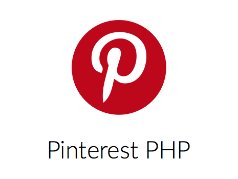

# Pinterest PHP

A wrapper library for the [Pinterest API](https://developers.pinterest.com/tools/api-explorer/).

**Work in progress, but ready for production.!**



<p align="center">
    <a href="https://travis-ci.org/hansott/pinterest-php"></a>
    <a href="https://scrutinizer-ci.com/g/hansott/pinterest-php/?branch=master"></a>
    <a href="https://scrutinizer-ci.com/g/hansott/pinterest-php/?branch=master"></a>
</p>

## Install

Via Composer

```bash
$ composer require hansott/pinterest-php
```

## Usage

### Authentication

To use the API, you need an Access Token from pinterest. [https://developers.pinterest.com/apps/](Create a new Pinterest application) if you haven't already. You then get a client ID and a client secret, specific for that application.

Back in your PHP application, create a Client instance (the default is `BuzzClient`) and use it to create an Authentication instance:

```php
$client = new Pinterest\Http\BuzzClient();
$auth = new Pinterest\Authentication($client, $clientId, $clientSecret);
```

Replace the `$clientId` and `$clientSecret` variables with the data of [https://developers.pinterest.com/apps/](your Pinterest application).

You can now let your user authenticate with your application be redirecting them to the URL obtained by a call to `$auth->getAuthenticationUrl()`, like this:

```php
use Pinterest\App\Scope;

$url = $auth->getAuthenticationUrl(
    'https://your/redirect/url/here',
    array(
        Scope::READ_PUBLIC,
        Scope::WRITE_PUBLIC,
        Scope::READ_RELATIONSHIPS,
        Scope::WRITE_RELATIONSHIPS,
    ),
    'random-string'
);

header('Location: ' . $url);
exit;
```

- The redirect URL is the URL to the page where pinterest will send us the authentication code for the user registering with your application. This URL needs to be accessible over https, and it has to be filled into to form of your Pinterst application (in the Pinterest backend).
- The second parameter is an array of permissions your app needs on the user's account. There needs to be at least one here.
- The validation state is a random code that you generate for the user registering, and persist (in SESSION for instance). Pinterest will send it back to us for further reference.

When your application user agrees to let your app take control of their Pinterest account via the API, Pinterest will redirect them to the URL you provided as redirect URL, with some added GET parameters. The most important being "code", which we'll trade for an OAuth Access Token in the next step. They'll also send the validation state back to us as a GET parameter so we can check if we expected this call.

The last step in the process is trading that code for an Access Token:

```php
$code = $_GET['code'];
$token = $auth->requestAccessToken($code);
```

You should persist that token safely at this point. You can use it from now on to connect to the Pinterest API from your application, on behalf of the user.

Initialize the Api class:

```php
$auth = Pinterest\Authentication::onlyAccessToken($client, $token);
$api = new Pinterest\Api($auth);
```

Using the `Pinterest\Api` instance in `$api`, you can now make authenticated API requests to Pinterest's API on behalf of the user.

## Contributing

Please see [CONTRIBUTING](CONTRIBUTING.md) for details.

## Security

If you discover any security related issues, please email [hansott@hotmail.be](mailto:hansott@hotmail.be) instead of using the issue tracker.

## Credits

- [Hans Ott](https://github.com/hansott)
- [Toon Daelman](https://github.com/turanct)

## License

The MIT License (MIT). Please see [License File](LICENSE.md) for more information.
